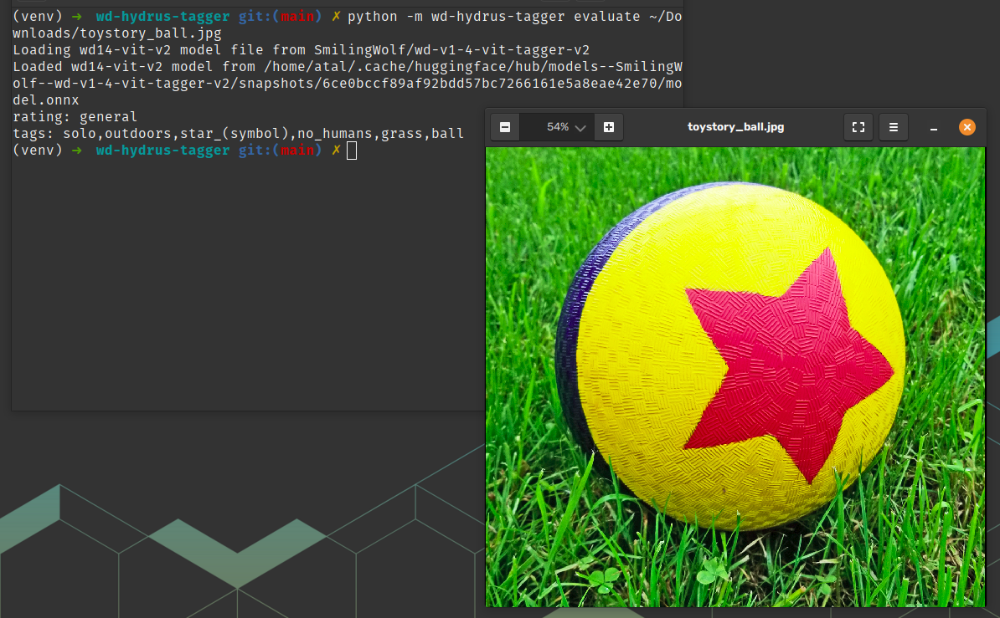

# wd-hydrus-tagger
wd-hydrus-tagger is a tool that uses the [Hydrus Network](https://github.com/hydrusnetwork/hydrus) API to tag your archived images with [the WD 1.4 Tagger model](https://huggingface.co/SmilingWolf/wd-v1-4-vit-tagger-v2).



## Requirements
* Python 3.9.x or 3.10.x
* Hydrus Network and an API key for your server

## Installing Dependencies
```bash
python -m venv venv # life is easier with a venv
source venv/bin/activate
pip install -r requirements.txt
```

## Running
### Evaluate a file
```bash
python -m wd-hydrus-tagger evaluate /path/to/file
```
Options:
```
  --cpu BOOLEAN      Use CPU instead of GPU
  --model TEXT       The tagging model version to use
  --threshold FLOAT  The threshhold to drop tags below
```

### Evaluate a file in Hydrus
```bash
python -m wd-hydrus-tagger evaluate-api --token your_hydrus_token 123_your_files_hash_456
```
Options:
```
  --token TEXT       The API token for your Hydrus server
  --cpu BOOLEAN      Use CPU instead of GPU
  --model TEXT       The tagging model version to use
  --threshold FLOAT  The threshhold to drop tags below
  --host TEXT        The URL for your Hydrus server
```